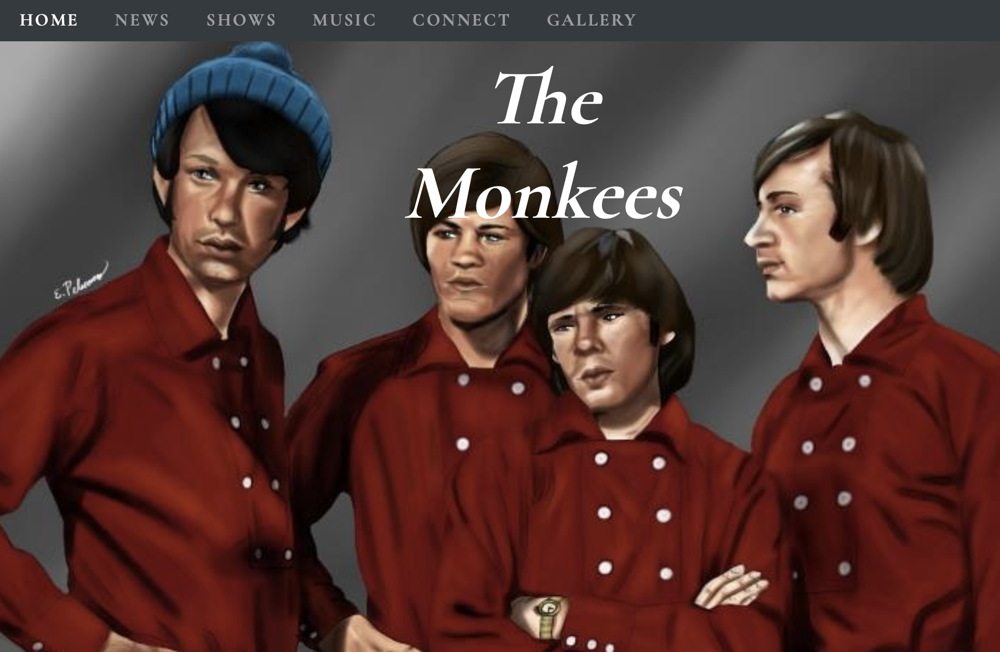

User-Centric Frontend Development Milestone Project  
------------------------

The is my front-end only website for a 1960’s rock band known as 'The Monkees'. The targeted audience were mainly the fans and for them 
to be able to use the site to access music either through an archive collection or any latest sounds available. 

Other features include band availability for private bookings and a new social media presence and the latest news to keep all updated with current events. This will bring an array of benefits
as everything will be able to be achieved by a click of a button, such as getting into contact or viewing the latest music.

#### Table of contents
* [Design](#design)
* [Technologies](#technologies)
* [Setup](#setup)
* [Features](#features)
* [Status](#status)
* [Inspiration](#inspiration)
* [Media](#media)
* [Acknowledgements](#acknowledgements)
* [Contact](#contact)

#### Design
When coming up with the design of the site, the concept was to make it easy and user friendly with quality interaction between a fan and their favourite band. 

Also for the viewers I wanted simplicity and not overcrowding them with lots of information but at the same time providing them with appealing and relevant content. This also includes young and old viewers who are not
very computer savvy but will still be able to manouver around the site with ease.

Format: 

#### Technologies

-  Cloud9
-  HTML
-  CSS
-  Bootstrap (4.3.1)

#### Setup

To be able to view this product you can access through github or live
[here][Project]. 

[Project]:https://shabbar786.github.io/User-Centric-milestone-project/

### Features

List of features ready and Todo's for future development

- Feature 1- Bootstrap navbar which collapses in mobile view.
- Feature 2 - Modal with a popup window which appears in centre screen
- Feature 3 - Responsive grid images when gallery link is selected.

To-do list:

- Improvement to be done 1 - Add a carousel feature as a menu option. To give it a more advance look with more option to choose from.
- Improvement to be done 2 - Instead of single scroll page add 4-5 pages with more features and animation enabling a more pleasurable UX for the viewer.

### Testing
The aim of the site through user interaction was accomplished. The website provided simple yet eye catching design and all required information was available to choose from.
In the Navbar section you had the main headings which, when clicked took you to the section through specific 'id' which was linked to each heading. 

A Model was added to the news section and also when clicked opened up a dialog box or popup window that was displayed on top of the current page. Every link opened up a new tab whether the information was available to view or not, 
just to be able to make it feel like a professional website.

This site was tested across multiple browsers and different mobile devices. When testing the site in responsive mode some images were not responding well to smaller screens sizes and were overlapping, which made the website out of place on smaller screens. This was causing the site to look visually
unattractive. The bug fix was to set the height of the images in CSS to 'Auto' and also in media queries certain height and font-size were reduced to requirement, this enabled them to respond on smaller devices.

Under the connect section if you tried to submit the email section without having entered anything in the box an error message will appear stating 'Fill out this field'. Also if you tried to enter
anything that was not an email address then also you would see a error message stating 'Enter an email address'.

All buttons had a subtle changes in color when hovered over them. I also changed the site in responsive mode under music section, I removed the iframes for the videos and another music card was added titled 'Audio'. This would give you the option to listen to their music in Mp3 
format, the reason for this was the iframes made the mobile view very unappealing with too much clutter. The the extra card added a more visually more desirable look.

### Status

Project is complete and in goodworking order. All initial tasks set up are completed and acheived.

### Inspiration

This project is for educational use only, the project was inspired for the better development of my career and to do something which I enjoy and and improve at the same time.

### Media

All images were taken from the websites below:

[Site1][Grid], [Site2](https://5dcreations.com/branding/20-free-social-media-background-1/ ), [Site3](https://www.tvinsider.com/756298/watch-the-monkees-tv-series-metv/), [Site4](https://www.npr.org/2018/12/29/676852011/the-monkees-tried-to-cut-their-strings-with-head?t=1560453184534), 

[Grid]: https://www.monkees.net/monkees-art-piece/, 

[Site5](https://www.pinterest.co.uk/pin/237001999119075592/), [Site6](http://nightflight.com/merry-christmas-the-monkeess-a-cappella-version-of-the-traditional-spanish-carol-riu-riu-chiu/), [Site7](https://instrumentalfx.co/the-monkees-im-a-believer-instrumental/), [Site8](https://www.pinterest.com/pin/143974519307681728/)

### Acknowledgements

My responsive image grid code was mentored around this
[site][Grid].

Majority of color codes used for the webpage were also taken from this
[site][Colors].

[colors]: https://www.lockedownseo.com/social-media-colors/

### Contact

Created by Mohammed shabbar, feel free to contact me on mohammed.shabbar1982@gmail.com.

